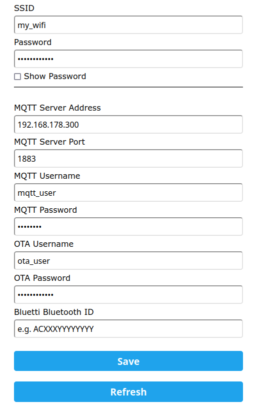

## About

This is an ESP32 based Bluetooth to MQTT Bride for BLUETTI power stations. The project is based on https://github.com/warhammerkid/bluetti_mqtt
The code is tested on an EB3A. Other Powerstations should also work but are untested yet. The discussion on https://diysolarforum.com/threads/monitoring-bluetti-systems.37870/ was a great help for understanding the protocol.

## Features

- easy configuration with WiFi manager
- display support 320x240
  - tested ESP32-CYD with display: https://github.com/witnessmenow/ESP32-Cheap-Yellow-Display
- mqtt support
- support for BLUETTI power stations
  - AC300 (tested)
  - AC200 (tested)
  - EB3A (tested)
  - EP500 (untested)
  - EP500P (tested)
  - EP600 (some values still missing)
- supported BLUETTI functions
  - commands
    - ac output on/off
    - dc output on/off
  - states
    - ac input power
    - dc input power
    - ac output power
    - dc output power
    - dsp firmware version
    - arm firmware version
    - serial number
    - device type
    - power generation
    - total battery percent

### Getting Started

1. Install [VSCode](https://code.visualstudio.com/download) and once finished, get the [PlatformIO](https://marketplace.visualstudio.com/items?itemName=platformio.platformio-ide) extension
2. Follow the instructions in [dependencies/README.md](dependencies/README.md) and update the required libraries
3. Once libraries are updated, use the PlatformIO build buttom to confirm the project compiles
4. Connect an [ESP32-CYD](https://github.com/witnessmenow/ESP32-Cheap-Yellow-Display), and upload the project onto the board. NOTE: the file being uploaded is [Bluetti_ESP32/Bluetti_ESP32.ino](Bluetti_ESP32/Bluetti_ESP32.ino)
5. After this step, continue with the instructions detailed in the Configuration portion of this README.md

## Configuration

### Usage

Just connect the ESP32 to a power supply or the power station itself. Connect your mobile phone or computer
to the Wifi mangaer of the ESP32 firmware, it should show up as "ESP32_Bluetti".

After the connection to the hotspot is established a wifi manager popup will appear. Otherwise
open 192.168.4.1 in your local webbrowser.

Select "Configure WiFi"

Configure your WiFi and set the address of your MQTT server and enter the Bluetooth ID of your
Bluetti Device. Optionally you can specify username and password to protect the web OTA interface.
You can use a mobile phone and/or the Bluetti APP for finding the correct Bluetooth ID of your device.

Save the settings. The ESP32 starts sending messages to your MQTT server.

Example ( ioBroker ):

### MQTT Topics

#### Commands

Commands are subscribed from

- /bluetti/<your_device_id>/command
  - ac_output_on
  - dc_output_on

#### State

States are published to

- /bluetti/<your_device_id>/state
  - ac_output_on
  - dc_output_on
  - dc_input_power
  - ac_input_power
  - ac_output_power
  - dc_output_power
  - serial
  - dsp_version
  - arm_version
  - power_generation
  - total_battery_percent

## Display

Config Display:

- By default, display is disabled.
- Configurations (customize of file Bluetti_ESP32/config.h):
  - Enable display: uncomment #define DISPLAYSSD1306 1
  - Enable reset of display on init: uncomment DISPLAY_RST_PORT
    - Known needed for LoRa TTGO v1.0
  - set SCL & SDA ports: default ports are set to SCL=4 & SDA5, to change update DISPLAY_SCL_PORT and DISPLAY_SDA_PORT

Display functionality:

- Show current assiged IP address (AP mode or normal)
- Show different wifi connection logo, depending on the mode its in and wifi Strength in normal mode (4 bars)
- Show the running time of the device in the format "11d12h15m" Currently max until 49 days as this is the time millis() is reset.
- Show status message, currently shows the init and running status, also BLEscan when scanning
- a progressbar is available but currently not used anywhere. (to see where it can be used)
- Show bluetooth icon status. Connected is static, blinking is trying to connect, together with message in case of scanning.
- Show MQTT icon status. Connected is static, blinking is trying to connect.

Example display screen:

## TODO

- add full feature set to device files
- adding support for SD-Card reader, for writing csv data to an sd-card
- adding logging poll commands

## Disclaimer

The code within this repository comes with no guarantee, use it on your own risk.

Don't touch these firmwares if you don't know how to put the device in the programming mode if something goes wrong.
As per the GPL v3 license, I assume no liability for any damage to you or any other person or equipment.
